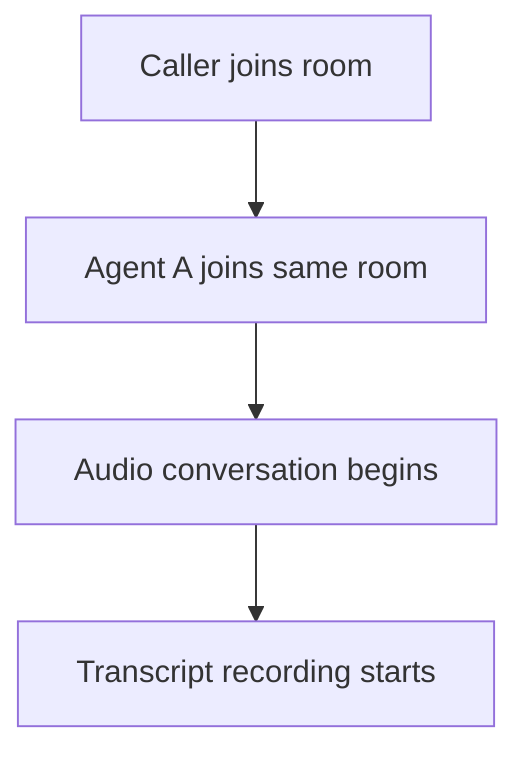
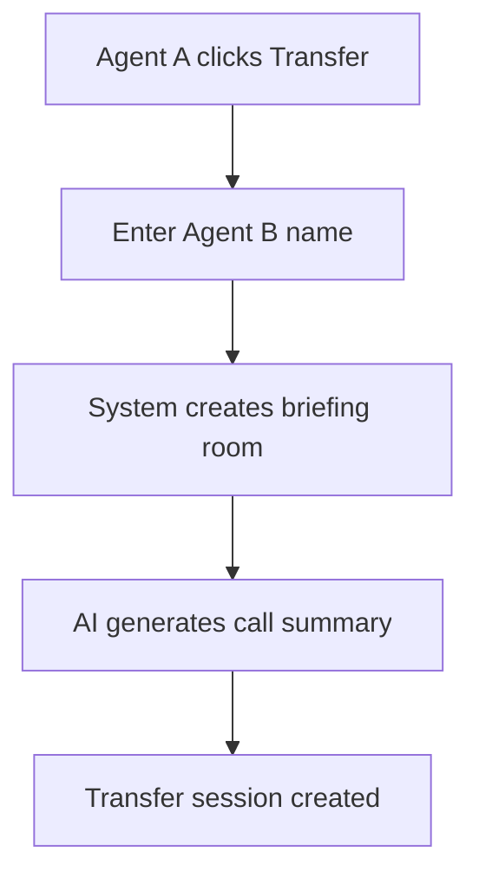
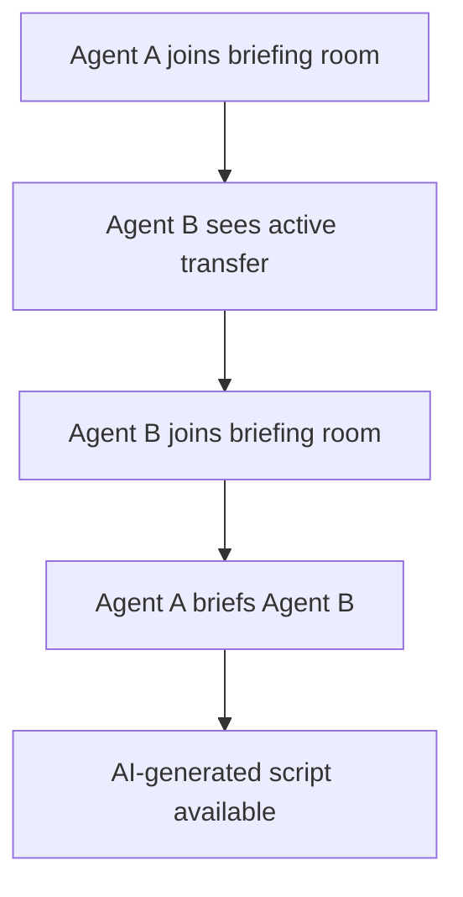
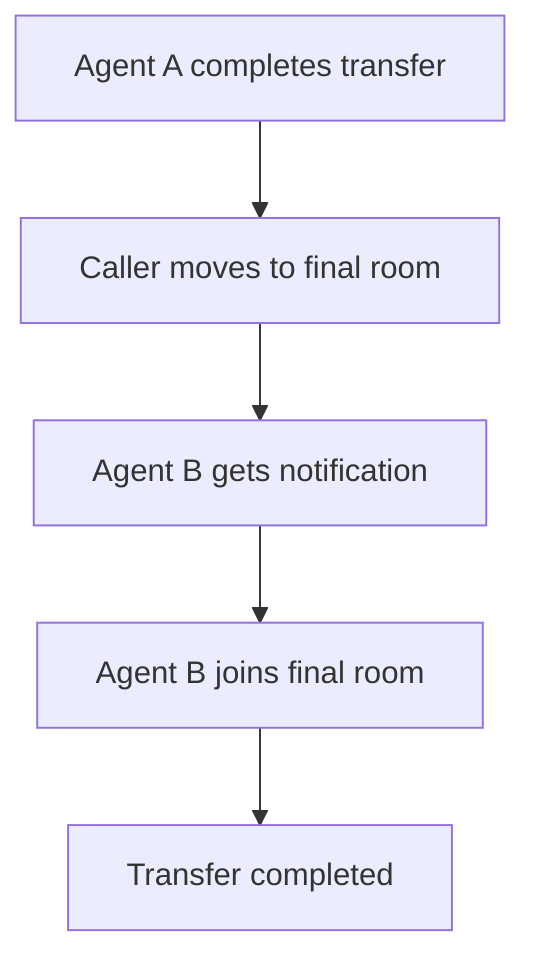

# Warm Call Transfer System

A real-time communication application built with **LiveKit**, **FastAPI**, and **Next.js** that enables seamless warm call transfers between agents in a call center environment. The system includes AI-powered call summaries and automated transfer workflows.

📹 Video Walkthrough: https://www.loom.com/share/32fdd169858c46e7b7dc8f001113849f?sid=dc2da037-3cb0-491a-a562-77965285683b


## 🚀 Features

- **Real-time Audio Communication**: WebRTC-based audio calling using LiveKit
- **Warm Call Transfers**: Seamless transfer of calls between agents with briefing sessions
- **AI-Powered Summaries**: Automatic call summary generation using LLM (OpenRouter)
- **Multiple User Roles**: Support for Caller, Agent A, and Agent B workflows
- **Live Transfer Status**: Real-time monitoring of active transfers
- **Automated Room Management**: Dynamic room creation and participant management

## 📋 Prerequisites

- **Node.js** (v18 or higher)
- **Python** (v3.8 or higher)
- **LiveKit Server** (running locally or cloud instance)
- **OpenRouter API Key** (for AI summaries)

## 🔧 Setup Instructions

### 1. Clone the Repository

```bash
git clone <repository-url>
cd Warm_Call_Transfer
```

### 2. LiveKit Server Setup

#### Option A: Local LiveKit Server (Recommended for Development)
1. Download LiveKit Server from [LiveKit Releases](https://github.com/livekit/livekit/releases)
2. Extract and run:
   ```bash
   ./livekit-server --dev
   ```
3. The server will run on `ws://localhost:7880`

#### Option B: LiveKit Cloud
1. Sign up at [LiveKit Cloud](https://cloud.livekit.io/)
2. Create a new project
3. Note your API key, secret, and WebSocket URL

### 3. Backend Setup

1. **Navigate to backend directory:**
   ```bash
   cd backend
   ```

2. **Install Python dependencies:**
   ```bash
   pip install -r requirements.txt
   ```

3. **Create environment file:**
   Create a `.env` file in the backend directory with the following content:
   ```env
   # LiveKit Configuration
   LIVEKIT_API_KEY=your_livekit_api_key
   LIVEKIT_API_SECRET=your_livekit_api_secret
   LIVEKIT_URL=ws://localhost:7880

   # OpenRouter API Key for AI Summaries
   OPENROUTER_API_KEY=your_openrouter_api_key
   ```

4. **Start the backend server:**
   ```bash
   python -m uvicorn app:app --host 0.0.0.0 --port 8000 --reload
   ```

   The backend API will be available at: `http://localhost:8000`

### 4. Frontend Setup

1. **Navigate to frontend directory:**
   ```bash
   cd frontend
   ```

2. **Install Node.js dependencies:**
   ```bash
   npm install
   ```

3. **Start the development server:**
   ```bash
   npm run dev -- --port 3001
   ```

   The frontend will be available at: `http://localhost:3001`

## 🔑 API Keys Configuration

### LiveKit API Keys

1. **For Local Development:**
   - API Key: `devkey`
   - API Secret: `secret`
   - URL: `ws://localhost:7880`

2. **For LiveKit Cloud:**
   - Sign up at [LiveKit Cloud](https://cloud.livekit.io/)
   - Create a project and get your credentials
   - Update the `.env` file with your actual credentials

### OpenRouter API Key

1. **Sign up** at [OpenRouter](https://openrouter.ai/)
2. **Create an API key** in your account settings
3. **Add the key** to your `.env` file:
   ```env
   OPENROUTER_API_KEY=sk-or-v1-xxxxxxxxxxxxxxxxxxxxxxxxxxxxxxxxxxxxxxxxxxxxxxxxxxxxxxxxxxxxx
   ```

> **Note:** The AI summary feature requires an OpenRouter API key. Without it, basic text summaries will be used instead.

## 🔄 Warm Transfer Workflow

The warm transfer system follows a structured workflow that ensures smooth handoffs between agents:

### 1. Initial Call Setup


1. **Caller** initiates a call by providing their information
2. **Agent A** joins the same room to handle the initial inquiry
3. Real-time audio communication is established
4. Call transcript is automatically recorded

### 2. Transfer Initiation


1. **Agent A** decides to transfer the call
2. **Agent A** specifies the target agent (Agent B)
3. System creates a separate **briefing room**
4. **AI generates** a comprehensive call summary
5. **Transfer session** is created with unique ID

### 3. Briefing Phase


1. **Agent A** automatically joins the briefing room
2. **Agent B** sees the active transfer in their interface
3. **Agent B** joins the briefing room
4. **Agent A** provides context using AI-generated script
5. Both agents can discuss the case privately

### 4. Transfer Completion


1. **Agent A** clicks "Complete Transfer"
2. **Caller** is automatically moved to final room
3. **Agent B** receives notification to join final room
4. **Agent B** joins final room with the caller
5. **Agent A** can disconnect

### 5. Status Monitoring & Polling

The system includes sophisticated status monitoring:

- **Agent B Polling**: Automatically checks for completed transfers every 3 seconds
- **Transfer Status API**: `/caller/{caller_name}/transfer-status` endpoint
- **Active Transfers**: `/transfers/active` endpoint for real-time status
- **Automatic Room Joining**: Agent B automatically joins when transfer completes

## 🎯 User Roles & Workflows

### Caller Workflow
1. Enter personal information (name, phone, issue)
2. Click "Start Call" to join the room
3. Wait for Agent A to join
4. Communicate with Agent A
5. Get transferred to Agent B when needed

### Agent A Workflow
1. Select "Agent A" role and enter name
2. Join active call room
3. Handle initial customer inquiry
4. When transfer needed:
   - Click "Initiate Transfer"
   - Enter Agent B name
   - Join briefing room
   - Brief Agent B using AI-generated script
   - Complete transfer

### Agent B Workflow
1. Select "Agent B" role and enter name
2. Monitor for active transfers (automatic polling)
3. Join briefing room when transfer appears
4. Listen to Agent A's briefing
5. Automatically join final room when transfer completes
6. Handle customer inquiry completion

## 🛠️ API Endpoints

### Call Management
- `POST /call/start` - Start a new call session
- `GET /call/{call_id}` - Get call session details
- `POST /call/{call_id}/join` - Join an existing call

### Transfer Management
- `POST /call/{call_id}/transfer` - Initiate warm transfer
- `POST /transfer/{transfer_id}/complete` - Complete transfer
- `GET /transfers/active` - Get active transfers
- `GET /caller/{caller_name}/transfer-status` - Check transfer status

### Room & Token Management
- `POST /token` - Generate LiveKit access token
- `GET /rooms/{room_name}/participants` - Get room participants

## 🐛 Troubleshooting

### Common Issues

1. **Connection Failed**
   - Verify LiveKit server is running
   - Check API credentials in `.env` file
   - Ensure ports 8000 and 3001 are available

2. **Audio Not Working**
   - Grant microphone permissions in browser
   - Check browser console for WebRTC errors
   - Verify audio device is connected

3. **Transfer Not Working**
   - Check backend logs for errors
   - Verify caller name consistency
   - Ensure Agent B is polling for transfers

4. **AI Summary Not Generated**
   - Verify OpenRouter API key is valid
   - Check internet connection
   - Review backend logs for API errors

### Development Tips

- **Backend logs**: Check console output for detailed error messages
- **Frontend logs**: Open browser DevTools console for client-side issues
- **Network tab**: Monitor API calls and responses
- **LiveKit logs**: Check LiveKit server console for connection issues

## 📝 Environment Variables

### Backend (.env)
```env
# LiveKit Configuration
LIVEKIT_API_KEY=your_livekit_api_key
LIVEKIT_API_SECRET=your_livekit_api_secret
LIVEKIT_URL=ws://localhost:7880

# AI Integration
OPENROUTER_API_KEY=your_openrouter_api_key
```

### Default Development Values
- Backend: `http://localhost:8000`
- Frontend: `http://localhost:3001`
- LiveKit: `ws://localhost:7880`

## 🚀 Production Deployment

### Backend Deployment
1. Set production environment variables
2. Use a production WSGI server (gunicorn)
3. Configure reverse proxy (nginx)
4. Enable HTTPS for secure WebRTC

### Frontend Deployment
1. Build the production bundle: `npm run build`
2. Deploy to static hosting or use `npm start`
3. Update API base URL for production backend

### LiveKit Production
1. Use LiveKit Cloud or deploy LiveKit server
2. Configure proper security settings
3. Update WebSocket URL to production endpoint

## 🤝 Contributing

1. Fork the repository
2. Create a feature branch
3. Make your changes
4. Test thoroughly
5. Submit a pull request

## 📄 License

This project is licensed under the MIT License - see the LICENSE file for details.

## 🆘 Support

For issues and questions:
1. Check the troubleshooting section
2. Review backend and frontend logs
3. Open an issue with detailed reproduction steps
4. Include environment information and error messages
